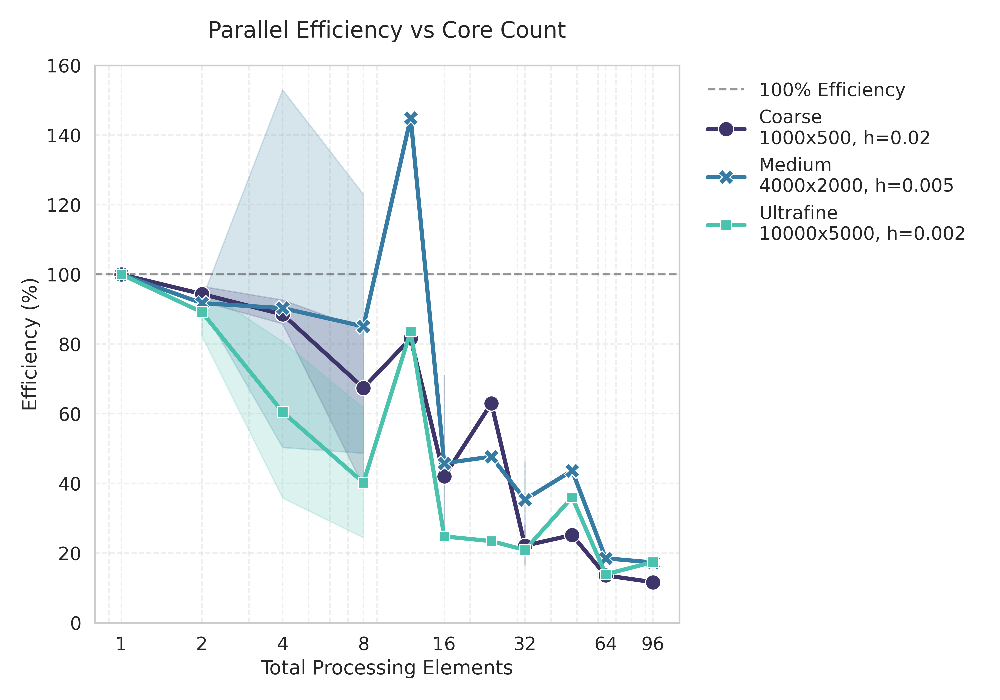
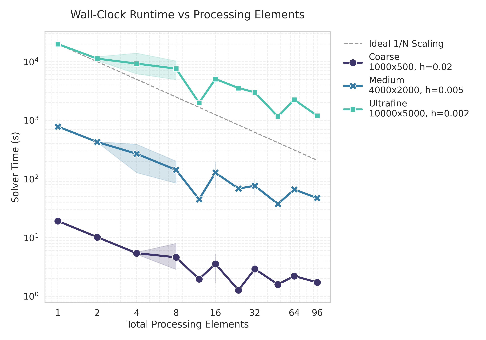
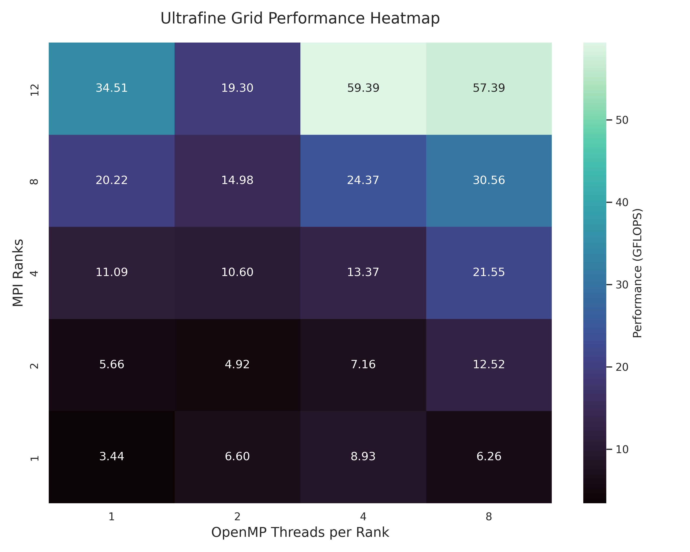

# Hybrid MPI+OpenMP SOR Solver for Coaxial Potentials

This repository contains a high-performance, hybrid-parallelised (MPI + OpenMP) Successive Over-Relaxation (SOR) solver, developed in modern Fortran. It computes the 2D electrostatic potential distribution within a coaxial conductor to millivolt accuracy. The codebase was designed to perform rigorous strong and weak scaling analysis on AMD EPYC Milan architectures, specifically the Viking 2 supercomputer, scaling execution to 96 processing elements.

Click  to read the full performance analysis and scaling report.

## Key Features

This solver is built around four core systems engineering principles to maximise parallel efficiency and bypass hardware latency cliffs:

### 1. Asynchronous Halo Exchange (MPI)
To manage domain decomposition across distributed memory, the solver utilises non-blocking MPI communication (`MPI_Isend` / `MPI_Irecv`). This architecture allows the solver to actively overlap network communication latency with bulk computation, ensuring the CPU remains saturated during cross-node data transfers.

### 2. Red-Black Checkerboard Ordering (OpenMP)
Standard SOR algorithms contain inherent data dependencies that prevent thread-level parallelisation. To solve this, a red-black spatial ordering scheme was implemented. By decoupling the grid into independent sub-domains, the inner computational loops are safely parallelised across shared-memory threads using OpenMP without race conditions.

### 3. Hardware & NUMA-Aware Execution
To optimise for the specific chiplet architecture of AMD EPYC processors, the execution scripts explicitly manage thread affinity and memory locality. By utilising `OMP_PROC_BIND=close`, `OMP_PLACES=cores`, and explicit socket mapping (`--map-by socket:PE=$t`), the execution environment prevents thread migration across Core Complex Die (CCD) boundaries, minimising L3 cache misses and cross-socket latency.

### 4. Distributed File I/O
To prevent file system contention and I/O bottlenecks during data export, the solver implements a file-per-rank output routine (`save_parallel_dat`). Each MPI rank concurrently writes its local data partition to a unique `.dat` file, which can be easily stitched together during post-processing.

## Discretised Laplace Equation
The Laplace Equation in cylindrical polar coordinates given by:

$$ \nabla^2\Phi=\frac{\partial^2\Phi}{\partial z^2}+\frac{1}{r}\frac{\partial\Phi}{\partial r}+\frac{\partial^2\Phi}{\partial r^2}+\frac{1}{r^2}\frac{\partial^2\Phi}{\partial \theta^2} \hspace{0.5cm} r>0 $$

The discretised equation for $r>0$ is given by:

$$ \Phi_{i,k}=\frac{1}{4}(\Phi_{i+1,k}+\Phi_{i-1,k} + \Phi_{i,k+1}+\Phi_{i,k-1}) + \frac{1}{8k}(\Phi_{i,k+1}-\Phi_{i,k-1}) $$

The discretised equation for $r=0$ is given by:

$$\Phi_{i,0}=\frac{2}{3}\Phi_{i,1}+\frac{1}{6}(\Phi_{i+1,0}+\Phi_{i-1,0})$$

## Performance & Scaling Analysis

Extensive benchmarking was conducted on the Viking supercluster (AMD EPYC 7643) across coarse, medium, and ultrafine grid resolutions. The scaling analysis revealed distinct performance regimes governed by the processor's memory hierarchy:

<p align="center">
  
  
</p>

### Key Hardware Insights

*   **Cache Locality & Super-Linear Scaling:** For the medium grid ($4000 \times 2000$), pure MPI execution (12 ranks) achieved super-linear scaling (over 150% efficiency). At this decomposition, sub-grid chunks fit optimally into the L3 cache, allowing memory access speeds to exceed the serial DRAM baseline.
*   **The NUMA Cliff:** On the ultrafine grid, increasing from 4 to 8 OpenMP threads per rank caused a distinct performance regression (dropping from 59.39 to 57.39 GFLOPS). Because each Core Complex Die (CCD) contains only 6 cores, 8 threads force high-latency communication across the Infinity Fabric.
*   **MPI vs. OpenMP:** For this memory-bound workload, increasing MPI ranks provided significantly more robust gains than threading. For instance, 8 ranks $\times$ 1 thread (20.22 GFLOPS) vastly outperformed 1 rank $\times$ 8 threads (6.25 GFLOPS), proving the necessity of engaging distributed memory controllers.

<p align="center">
  
</p>

### The Ultimate Performance Run

Applying the insights above, a final proof-of-concept run was designed to perfectly map the software to the hardware topology. By executing **16 MPI ranks × 6 OpenMP threads**, every single rank was perfectly contained within its own CCD. 

This CCD-aligned configuration eliminated cross-chiplet latency and achieved a peak throughput of **184.37 GFLOPS**—a 53.6× speedup over the serial baseline, and a 300% performance increase over a non-aligned 96-core configuration. 

| Configuration | Total Cores | Wall-Clock Time (s) | Performance (GFLOPS) |
| :--- | :---: | :---: | :---: |
| Socket Aligned (12 × 8) | 96 | 1196.57 | 57.39 |
| **CCD Aligned (16 × 6)** | **96** | **372.49** | **184.37** |

*Table 1: Comparison of node-level parallel configurations for the ultrafine grid (10000 × 5000). The CCD-aligned configuration demonstrates the significant performance benefit of matching software threads to the hardware's physical chiplet boundaries.*

## Running the Code

### Prerequisites
* GNU Fortran (`gfortran`)
* MPI
* OpenMP

### Compilation & Execution

The code is designed to be compiled with the GNU Fortran compiler, leveraging `-O3` for automatic vectorisation and loop unrolling.

```bash
# Compile the hybrid solver
mpif90 -O3 -fopenmp -o coax_hybrid src/coax_hybrid.f90

# Example execution (4 MPI ranks, 8 OpenMP threads per rank)
export OMP_NUM_THREADS=8
export OMP_PLACES=cores
export OMP_PROC_BIND=close

mpirun -np 4 --map-by socket:PE=8 ./coax_hybrid
